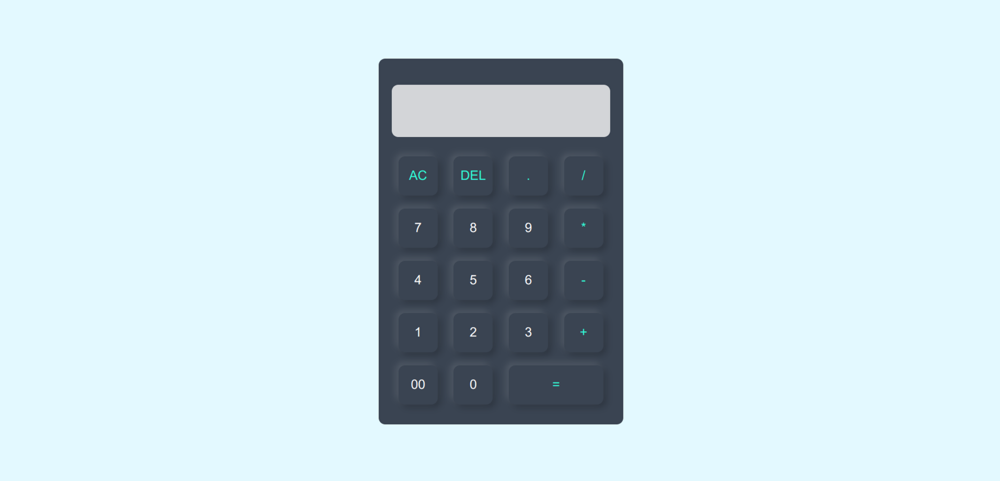

## 📝 Calculadora em HTML, CSS e JavaScript

Este é um projeto simples de uma **calculadora** interativa criada com HTML, CSS e JavaScript. A calculadora pode realizar operações básicas como soma, subtração, multiplicação, divisão e limpar a tela. Também conta com a funcionalidade de apagar o último caractere digitado, e de detectar e exibir erros de sintaxe.

#### Funcionalidades:

- Realizar operações de soma, subtração, multiplicação e divisão.
- Exibir um erro de sintaxe se dois operadores consecutivos forem digitados.
- Apagar o último caractere digitado.
- Limpar a tela completamente.
- Suporte para números decimais.

#### Estrutura de Arquivos:

- **index.html**: O arquivo principal que contém a estrutura HTML da calculadora.
- **style.css**: O arquivo de estilo que define o layout e a aparência da calculadora.
- **script.js**: O arquivo de script que contém a lógica para o funcionamento da calculadora, incluindo a verificação de erros.

#### Tecnologias Utilizadas:

- **HTML5**: Para estruturar a página e os elementos da calculadora.
- **CSS3**: Para o estilo e design da calculadora, utilizando técnicas modernas como sombras e bordas arredondadas.
- **JavaScript**: Para a interação dinâmica da calculadora, como cálculo de resultados e verificação de erros.

#### Preview:

